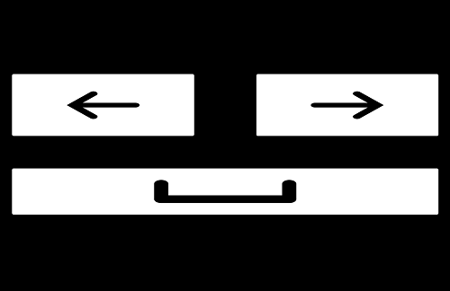

# Remote control
Allows the user to use the computer's keyboard from other devices. It's mainly meant to be used for watching media, with 3 keys being able to be pressed this way so far:
- Spacebar - pause/play
- Left Arrow key - rewind
- Right Arrow key - forward

As of now, it's possible to remotely control the computer's keyboard from a website. It should be able to do this from more devices soon.

