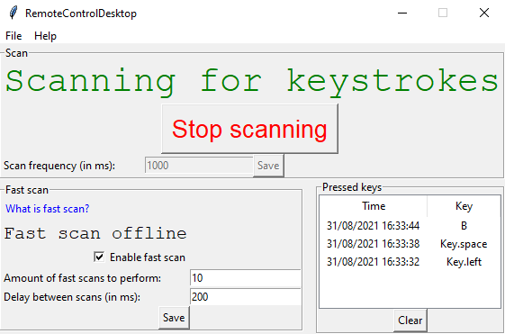

# Remote control
Allows the user to use the computer's keyboard from other devices. It's mainly meant to be used for watching media. Supports up to 6 keys, the 3 keys are not changeable:
- Spacebar - pause/play
- Left Arrow key - rewind
- Right Arrow key - forward
3 more keys can be modified by the user.

There are also 2 indicator lights that determine whether the key press was successfully sent and delivered or not
- First light (the left one) - determines whether the device successfully sent the key press
- Second light (the right one) - determines whether the desktop app acknowledged the key press

## Desktop part

*Languages used: Python*

Detects remote key presses and immediately performs them. The user can change certain settings using a GUI application.

 

## Website part

*Languages used: HTML, CSS, JavaScript, PHP*

Provides a way to perform remote key presses using a website. The .php files are required for the other parts of this project to work, the other files are optional.

 

## Watch part

*Languages used: HTML, CSS, JavaScript*

Provides a way to perform remote key presses using a smart watch. The application has been successfully tested on a real device (Samsung Galaxy Watch Active2) and it can probably only be used on Tizen OS-based watches. Includes a widget.

## Android part

*Languages used: Java*
Provides a way to perform remote key presses using a phone with Android OS. This part is still under development and there are yet features to be added.