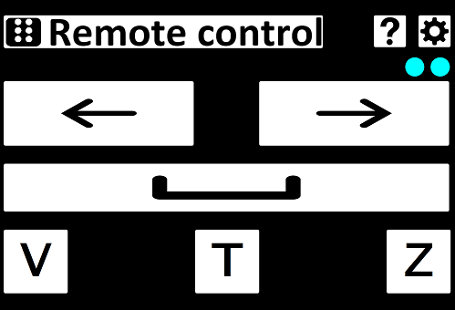

# Remote control
Allows the user to use the computer's keyboard from other devices. It's mainly meant to be used for watching media, with 3 keys being able to be pressed this way so far:
- Spacebar - pause/play
- Left Arrow key - rewind
- Right Arrow key - forward

 

## Desktop part

*Languages used: Python*

Detects remote key presses and immediately performs them. For now there's no GUI, the key presses are printed to console.

## Website part

*Languages used: HTML, CSS, JavaSscript, PHP*

Provides a way to perform remote key presses using a website. It's not required to use all the files included in this part, the only required file is *sendKeyStroke.PHP*.

## Watch part

*Languages used: HTML, CSS, JavaSscript*

Provides a way to perform remote key presses using a smart watch. The application has been successfully tested on a real device (Samsung Galaxy Watch Active2) and it can probably only be used on Tizen OS-based watches. Includes a widget.
